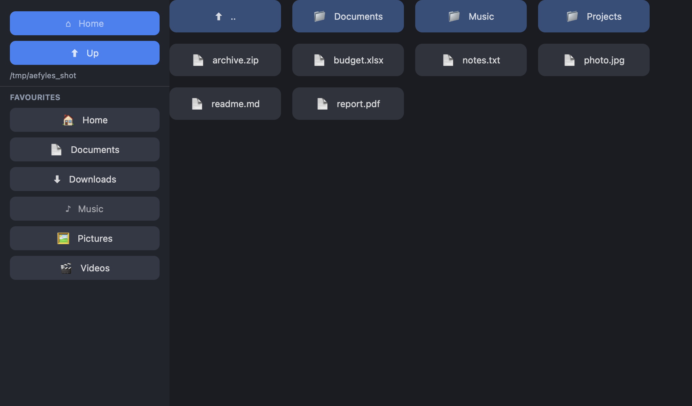

# aefyles

A file browser, in [Aether UI](https://github.com/aether-lang-org/aether-ui).

A from-scratch port of [FyshOS/fyles](https://github.com/FyshOS/fyles) — a
Fyne file browser written in Go — to Aether and its declarative widget DSL.
One readable script *is* the application: a sidebar (navigation + favourites)
and a grid of the current directory. Click a folder to descend, a file to open
it with the OS default app.



```aether
aether_ui.window("aefyles", 980, 640) {
    root_v = aether_ui.hstack(0) {
        sidebar = aether_ui.vstack(8) {
            home_btn = aether_ui.btn("⌂   Home") callback { activate(grid_cell, label_cell, cwd_cell, home_p, 1) }
            up_btn   = aether_ui.btn("⬆   Up")   callback { go_up(grid_cell, label_cell, cwd_cell) }
            path_label = aether_ui.text(start)
            aether_ui.divider()
            // FAVOURITES + Home / Documents / Downloads / Music / Pictures / Videos
            ...
        }
        file_grid = aether_ui.grid(COLS, 16, 16) { }   // repainted on every navigation
    }
    repaint(grid_cell, label_cell, cwd_cell)           // paint the starting directory
}
```

## The port: imperative → declarative

Fyne is **imperative** — fyles' panel mutates widgets in place on every
directory change (`Panel.SetDir` rewrites the icon grid). Aether UI is
**declarative** (a "DSL with Scope": nested builder blocks with an implicit
`_ctx` receiver). So the port splits cleanly in two, and that split is the
whole point:

| File | What it is | Lines |
|------|-----------|------:|
| [`model.ae`](model.ae) | **Pure, headless, fully tested.** A directory becomes a sorted, filtered list of `(kind, name)` entries; plus the path arithmetic for navigating (parent, display name, favourites). No UI. | 207 |
| [`fyles.ae`](fyles.ae) | **The single declarative script.** The whole window described in the DSL. A directory change is just "ask the model again and repaint the grid". | 181 |
| [`glue.ae`](glue.ae) | Thin non-UI glue: shared mutable cells, launching a file with the OS, picking the start directory. | 89 |

fyles' imperative heart — `SetDir`, which mutates the panel — becomes a pure
function `model.read_entries(dir, show_hidden)` that is *provably correct on
its own*, plus a `repaint()` that clears the grid and rebuilds it from the
model. The model never imports the UI, so it is tested with no display at all.

## Quick start

Requires the [Aether toolchain](https://github.com/aether-lang-org/aether)
(`ae` / `aetherc`) and a checkout of
[aether-ui](https://github.com/aether-lang-org/aether-ui) as a sibling
directory (`../aether-ui`), which supplies the platform backend.

```bash
./build.sh fyles.ae          # → build/fyles   (macOS AppKit, or Linux GTK4)
./build/fyles                # browse $HOME
./build/fyles /some/dir      # browse a directory (fyles takes a path arg too)
```

Point `build.sh` at a different aether-ui checkout with `AETHER_UI_DIR=...`.

## Tests

Two layers, both runnable from a clean checkout:

```bash
./test.sh        # headless model tests — no display. 25 assertions:
                 # encoding, hidden filter, dir-first ordering, navigation,
                 # and reading a real fixture directory back.

./test_app.sh    # end-to-end. Builds the app, launches it against a fixture,
                 # and drives the real window over the AetherUIDriver (the HTTP
                 # automation server aether_ui ships) to prove the live grid
                 # paints, descends, and climbs back. Needs a desktop session.
```

`test.sh`'s `main()` returns the failure count as its exit code; `test_app.sh`
exits non-zero on any failed check. Both are green on macOS.

Set `AEFYLES_DRIVER_PORT` to arm the built-in AetherUIDriver HTTP server (and
its "Under Remote Control" banner) — off by default, so a normal run is clean.
`test_app.sh` sets it automatically.

## What it does

- **Sidebar** — Home and Up (parent) navigation, the current path, and a
  Favourites list (Home + the user directories: Documents, Downloads, Music,
  Pictures, Videos).
- **File grid** — the current directory: folders first (blue cards), then
  files, sorted case-insensitively, dotfiles hidden, with a `⬆  ..` cell to go
  up. Click a folder to descend; click a file to open it with the OS default
  app (`open` on macOS, `xdg-open` on Linux).

### Notes & limitations

The layout is shaped by what the aether-ui AppKit backend supports today
(several gaps filed upstream as
[aether-ui issues](https://github.com/aether-lang-org/aether-ui/issues)):

- **Fixed window size.** The macOS surface sizes the window to its content's
  fitting size rather than pinning the root to fill, and NSStackView drops
  height constraints on stacked children — so the window opens at a set size
  rather than reflowing on resize.
- **Dark theme.** The build renders under the system (dark) appearance; aefyles
  leans into it rather than fighting the default control colours.
- **No right-click menus / file-type icons / reflowing grid** — aether-ui has
  no secondary-click event, file-icon API, or wrapping grid yet (so cells use
  emoji glyphs and a fixed column count). fyles' filesystem **tree**, **"Open
  With…"** menus, folder background art (`fancyfs`), and multi-panel windows are
  likewise not ported. The architecture leaves room for all of them: they're
  more model + more DSL, not a redesign.

## Credits

An independent, from-scratch reimplementation in Aether — no source is copied
from the works it references:

- **[FyshOS/fyles](https://github.com/FyshOS/fyles)** by Andy Williams and the
  Fyne.io developers — the file browser this app ports (BSD 3-Clause).
- **[Aether UI](https://github.com/aether-lang-org/aether-ui)** /
  **[Perry](https://github.com/PerryTS/perry)** — the declarative widget DSL
  this app is built on (MIT).
- **[Aether](https://github.com/aether-lang-org/aether)** — the language and
  toolchain.

Licensed [MIT](LICENSE).
